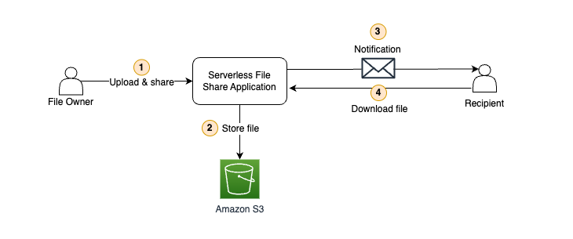
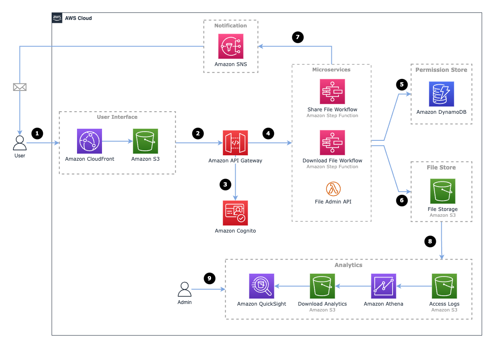

# Serverless File Sharing Project

This is an open-source project based on the original [AWS Serverless File Sharing Step Functions example](https://aws.amazon.com/blogs/compute/enhancing-file-sharing-using-amazon-s3-and-aws-step-functions/). The original sample is not formatted for production use and is otherwise a little dated. This project is a modernized version built on *.NET 8.0*. 

## Project Structure

The project is split into 2 code bases:
1. **[CDK Project](src/Cdk)** - An AWS CDK (Cloud Development Kit) project which deploys the infrastructure and backend. 
2. **[UI Project](src/Ui)** - A Razor Pages application which provides the user interface (UI).

## Getting Started

// getting started steps

## Overview

This project creates an application on AWS which allows file owners and recipients to share and recieve files.

> [!NOTE]
> This application is essentially a "transpiled" version of the original sample project, so the architectures are mostly the same.

*Figure 1: High level overview of the project*

1. The file owner logs into the application and uploads a file and elects to share their file with 1 or more recipients.

2. Uploaded files are stored in an Amazon S3 bucket managed by the application.

3. The application sends a notification to the recipients which includes a download link and instructions to access their file.

4. The recipient accesses the download link. The link will authenticate the user using their email address and check if the recipient is authorised to download the file before serving it to the recipient. 

## The Architecture

The architecture of the application is made up of a number of serverless AWS services as shown in the diagram below.

*Figure 2: Architecture of the application*

## License Summary

This open source project is made available under the MIT-0 license. See the LICENSE file.